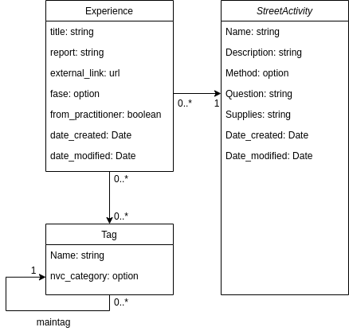
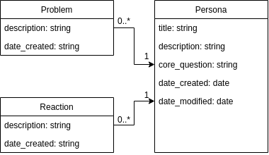

# Gemene Grond

An open platform for practicing equanimity in public spaces.

## About Gemene Grond

Gemene Grond facilitates street activities to practice equanimity - the art of being open to what is, without judgment or expectation. The platform supports both practitioners and passers-by in sharing their experiences.

### Philosophy

We see the street as a training ground for inner freedom. Not to make contact, but to be open to what is. The practitioner is like **soil** - everything that happens (smile, frown, silence) is **nutrient** for presence.

### Features

- **Street Activities**: Inviting or approaching strangers
- **Experience Sharing**: Anonymous reflections with NVC-based tags
- **Personas**: Insights into different types of passers-by
- **Collective Understanding**: Recognizing patterns in how activities are experienced

## Technical Stack

- **Backend**: Django 4.2+
- **Frontend**: Bootstrap 5, Bootswatch themes
- **Database**: SQLite (development) / PostgreSQL (production)

## Quick Start

```bash
# Clone repository
git clone https://github.com/username/gemene-grond.git
cd gemene-grond

# Create virtual environment
python -m venv venv
source venv/bin/activate  # Linux/Mac
# or
venv\Scripts\activate  # Windows

# Install requirements
pip install -r requirements.txt

# Run migrations
python manage.py migrate

# Load initial data (optional)
python manage.py loaddata initial_tags
python manage.py loaddata initial_streetactivities
python manage.py loaddata initial_personas

# Create superuser
python manage.py createsuperuser

# Run development server
python manage.py runserver

Visit http://localhost:8000 to see the application.
```

## Data Models



### Street Activities (StreetActivity)

- Activities to engage with strangers
- Methods: invite, approach, or both
- Includes description and supplies

### Experiences (Experience)

- Reflections from practitioners and passers-by
- Phases: pioneer, intermediate, or climax experience
- NVC-based tagging system

### Tags (Tag)

- Based on Nonviolent Communication (NVC)
- Categories: needs, fulfilled feelings, unfulfilled feelings
- Hierarchical structure with main tags



### Personas (Persona)

- Typologies of passers-by
- With related problems and reactions

## API Endpoints

*In development*

- /api/streetactivities/ - List and create street activities
- /api/experiences/ - Share and browse experiences
- /api/personas/ - Access persona information

## Licence

MIT License file - see [LICENSE](LICENSE.md) file

## Contributing

We welcome contributions! See [CONTRIBUTING.md](CONTRIBUTING.md) for guidelines
