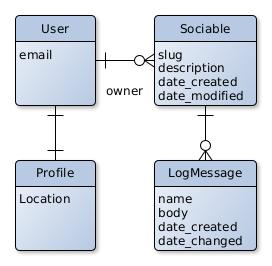

# Bedank voor het gesprek (before Traveling Guestbook)
## Empowers people to start conversations

### Description
The aim of this web-application is to facilitate conversation enders with people you do not know, for example people in the train. You can end the conversation by handing out a thank you, the sociable.

It is a web-application where people that received a code on a sociable, can leave a message.

Sociables are the conversation enders. You can end a conversation by thanking the other person with a sociable. The hope is that others will also thank others with the same sociable. In that way, the physical item is passed on from person to person.
The physical sociable has a code. This code is used to find the page of the sociable. Every time it is passed on, the person who received it leaves a message on the sociable page.

### Language
The Web-Application is in Dutch. The code and back-end is in English.

### Domain model

#### Glossary
- **Sociable:** The physical item that is to thank the other for the conversation, in the hope that the other will also thank others with the same sociable for the conversation.
- **LogMessage:** With the code on the sociable, the receiver leaves a message on the sociable detail page. He can write about his experiences of the conversation.
-  **User:** Users can create sociables and start spreading them around. Messages can be left by anyone with the proper sociable code. You do not need an account for that.

### Contributing
You can fine the contribution guidelines here:
[Contribution guidelines for this project](CONTRIBUTING.md)