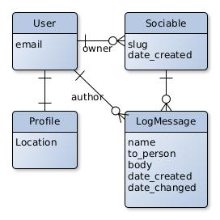

# Traveling Guestbook
## Empowers people to start conversations

### Description
The aim of this web-application is to facilitate conversation starters with people they do not know, for example people in the train.

It is a web-application where people that received a code on a sociable, can leave a message.

Sociables are the conversation starters.
Sociables are physical items that are passed on from person to person. The physical sociable has a code, that is used to find the page of the sociable. Every time it is passed on, the person who received it leaves a message on the sociable page.
Sociables have goals, which can be a question to answer in a message.

### Domain model

### References
<a name="f1">1</a>: Stueben, M. (2018). Good Habits for Great Coding. In Apress eBooks

<a name="f2">2</a>: Cowan, N. (2010). The Magical Mystery Four. Current Directions in Psychological Science, 19(1), 51–57

<a name="f3">3</a>: Visser, J., Rigal, S., Van Der Leek, R., Van Eck, P., & Wijnholds, G. (2016). Building Maintainable Software, Java Edition: Ten Guidelines for Future-Proof Code. “O’Reilly Media, Inc.”

